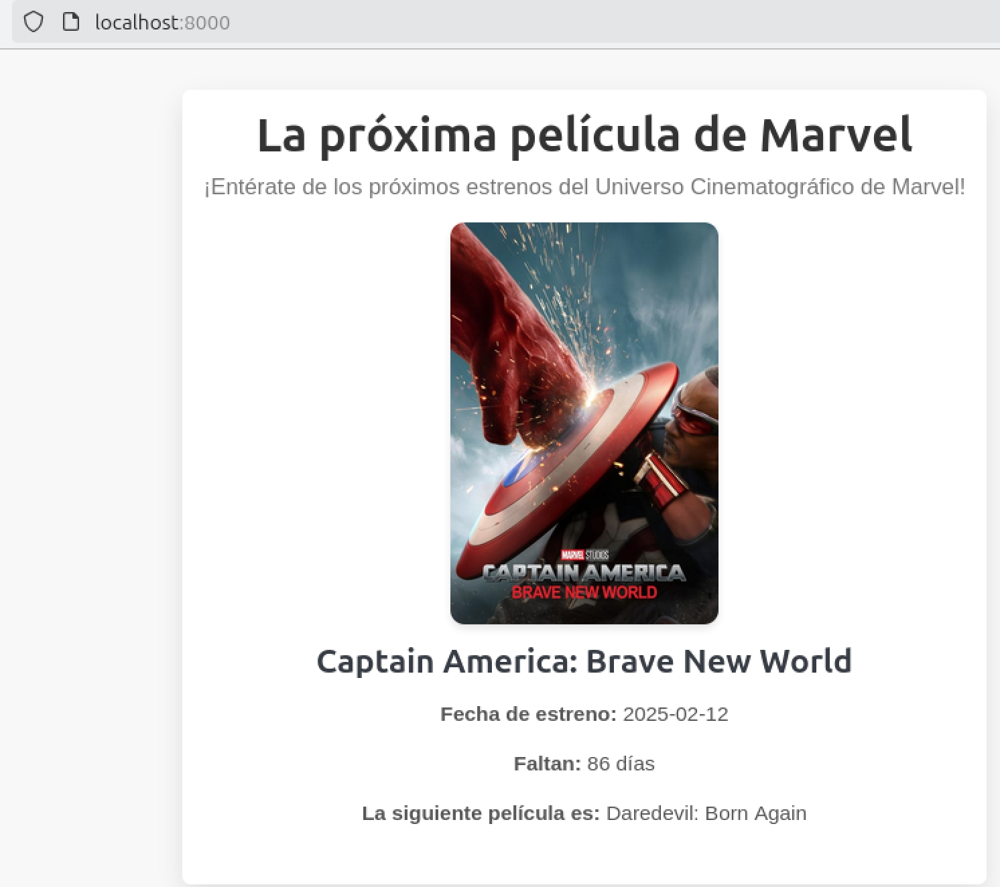

# La Próxima Película de Marvel - Proyecto PHP

Este proyecto consiste en una página web que muestra información sobre la próxima película del Universo Cinematográfico de Marvel (MCU). La información se obtiene de una API pública (`https://whenisthenextmcufilm.com/api`) y se presenta de manera atractiva utilizando HTML, PHP y CSS.

## Objetivo

El objetivo de este proyecto es mostrar la próxima película de Marvel, su fecha de estreno, la cantidad de días restantes hasta el estreno y detalles sobre la siguiente producción de la saga. La página hace uso de una API para obtener los datos dinámicamente y presenta la información de manera visualmente atractiva.

### Funcionalidades:
- **Obtención de datos en tiempo real**: Se realiza una solicitud a la API para obtener la información de la próxima película de Marvel.
- **Interfaz limpia y sencilla**: Usando el framework **PicoCSS**, la página está diseñada para ser simple y fácil de navegar.
- **Diseño atractivo**: Incluye detalles visuales como sombras, bordes redondeados y efectos hover en las imágenes.

## Tecnologías utilizadas

- **PHP**: Para realizar la solicitud a la API y manejar los datos dinámicamente.
- **HTML/CSS**: Para estructurar y diseñar la página.
- **PicoCSS**: Para una apariencia minimalista y moderna.
- **Zeabur**: El proyecto se desplegó en [Zeabur](https://zeabur.com/), lo que permite que el proyecto sea accesible públicamente a través de la siguiente URL:

  [https://marvel-php-film.free.zeabur.app/](https://marvel-php-film.free.zeabur.app/)

## Instrucciones

1. **Clona el repositorio**:
   ```bash
   git clone https://github.com/Mactuber/curso-php-midulive.git


### Detalles para GitHub:

- **Proyecto**: "La Próxima Película de Marvel - Proyecto PHP"
- **Descripción**: Visualización de la próxima película de Marvel a partir de datos obtenidos desde una API pública.
- **Tecnologías**: PHP, HTML, CSS, Zeabur, PicoCSS.

## VISUALIZACIÓN DEL PROYECTO:

